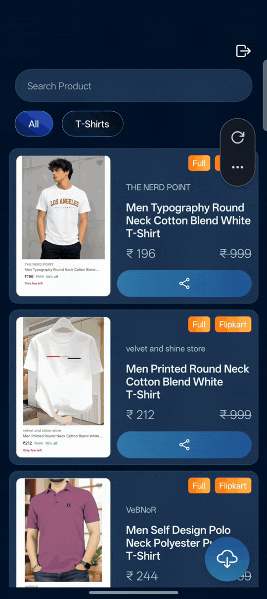

<div align="center">


## Aladdin

**Find deals. Pick the good ones. Post them everywhere.**

Scrapes Amazon.in and Flipkart for discounts, and gives you a mobile app to
curate the results, attach affiliate links, and push finished deal posts to
your channels.

[]()
[]()
[]()
[]()
[]()
[]()

<br>



</div>

<br>

## Why this exists

Running deal channels on Telegram always came down to the same loop: open
Amazon, hunt for discounts, screenshot the product, write a caption, paste an
affiliate link, repeat for Flipkart, then do it all again tomorrow.

Aladdin automates that loop. A scraper keeps an eye on both stores around the
clock, everything it finds lands in a database, and the mobile app lets you
browse the feed, pick the deals actually worth posting, and share a polished
collage with caption and hashtags in one tap. The boring parts — screenshots,
image cleanup, posting — happen without you.

## How it fits together

Four services, each doing one job:

- **Scraper** — `apps/scrapper`
  Playwright bots crawl Amazon.in and Flipkart across a rotating catalog of
  categories. Junk gets filtered out (low discounts, unavailable stock,
  duplicates via Redis) and what survives is written to Supabase. Screenshot
  jobs are queued as it goes. It runs two ways: an on-demand Express API on
  port 8080, or a scheduled cron run.

- **Screenshot service** — `apps/screenshot`
  A Puppeteer worker that picks screenshot jobs off a BullMQ queue. Two
  modes: *full* mode crops the product image and price off a detail page,
  and *grouped* mode grabs up to four matching cards from search results
  (sponsored ads and out-of-range prices are dropped). Results upload
  straight to Supabase Storage. Runs on port 3000, with a retry queue for
  anything that fails.

- **Mobile app** — `apps/android`
  Expo / React Native, and where you'll actually spend your time. Infinite
  scrolling product feed with search and category filters, long-press to
  select up to 16 deals at once, manage affiliate links per product,
  generate a shareable collage, edit the caption, and post it.

- **Telegram edge function** — `apps/edge-function`
  A small Deno function deployed on Supabase. It takes the collage, caption,
  and hashtags, and posts them to your Telegram channel via the Bot API.
  If Telegram isn't among the selected platforms, it quietly does nothing.

```
  ┌──────────────┐   jobs    ┌───────────────────┐  images  ┌──────────┐
  │   Scraper    ├──────────▶│ Screenshot service├─────────▶│ Supabase │
  │ (Playwright) │           │    (Puppeteer)    │          │ Storage  │
  └──────┬───────┘           └───────────────────┘          └────┬─────┘
         │ products                        Supabase Auth         │
         ▼                                     │                ▼
  ┌─────────────────────────────────────────────▼────────────────────┐
  │                        Mobile app (Expo)                          │
  │              browse · curate · affiliate links · share            │
  └───────────────────────────────┬──────────────────────────────────┘
                                  │  post
                                  ▼
                       ┌────────────────────┐
                       │ Telegram via Edge  │
                       │      Function      │
                       └────────────────────┘
```

## Repo layout

```
apps/
├── android/         Expo mobile app (deal curation & sharing)
├── scrapper/        Playwright scraper + Express API
├── screenshot/      Puppeteer screenshot worker (BullMQ)
└── edge-function/   Supabase edge function (Telegram posting)
assets/              Logo and demo media
compose.yml          Docker setup for the two Node services
```

<br>

## Getting started

You'll need:

- **Node.js 22+** and **pnpm** (the two Node services are separate pnpm projects — there's no root package.json)
- **Docker** for running the scraper and screenshot service
- **Redis** reachable from both services (the compose file doesn't manage it — run your own or point `REDIS_HOST` at an existing one)
- A **Supabase** project (Postgres, Auth, and Storage)
- An Android device or emulator for the app

### 1. Clone and configure

```bash
git clone git@github.com:abdurrab-khan/aladdin-scrapper.git
cd aladdin-scrapper

cp .env.example .env
# Fill in USER_ID, platform IDs, Supabase credentials, Redis password,
# and your Telegram bot token / chat ID
```

### 2. Bring up the services

```bash
docker compose up -d --build
```

This starts the scraper on port **8080** and the screenshot service on port
**3000**. Redis is expected to be running already.

### 3. Run the scraper

Either trigger it through the API, or run it on a schedule:

```bash
cd apps/scrapper
pnpm install
pnpm cron
```

### 4. Start the mobile app

```bash
cd apps/android
npm install
npx expo start
```

Log in with a Supabase account and you should see whatever the scraper has
collected so far.

### 5. Deploy the edge function

```bash
cd apps/edge-function
supabase functions deploy share-product
```

Set `TELEGRAM_BOT_TOKEN` and `TELEGRAM_CHAT_ID` as function secrets, and the
app can post straight to your channel from the share screen.

## Environment variables

Everything lives in the root `.env` — see `.env.example` for the template:

| Variable | Used by | What it is |
| --- | --- | --- |
| `USER_ID` | Scrapper | Owner ID attached to scraped products |
| `AMAZON_PLATFORM_ID` / `FLIPKART_PLATFORM_ID` | Scrapper | Platform rows in the database |
| `SUPABASE_URL` / `SUPABASE_KEY` / `SUPABASE_BUCKET` | Scrapper, Screenshot, Mobile | Supabase project and storage bucket |
| `REDIS_HOST` / `REDIS_PORT` / `REDIS_PASSWORD` | Scrapper, Screenshot | Redis connection (dedupe cache + BullMQ) |
| `SCREENSHOT_SERVICE_URL` | Scrapper | Where the scraper enqueues screenshot jobs |
| `TELEGRAM_BOT_TOKEN` / `TELEGRAM_CHAT_ID` | Edge function | Telegram bot credentials |
| `EXPO_PUBLIC_SUPABASE_*` | Mobile app | Supabase client config |

## Tech stack

- **Mobile:** Expo SDK 54, React Native 0.81, expo-router, Zustand, TanStack Query, react-hook-form + Zod
- **Scraper:** Node 22, Playwright, Express 5, Zod, Supabase JS, Redis
- **Screenshot:** Node 22, Puppeteer, BullMQ, ioredis, Express 5
- **Edge function:** Deno, Telegram Bot API
- **Infrastructure:** Supabase (Postgres / Auth / Storage), Redis, Docker Compose, EAS Build

## Known limitations

Worth being upfront about:

- **Telegram is the only share target right now.** Instagram, Facebook, and X
  are planned — the share flow in the app is already designed around multiple
  platforms, so it's a matter of wiring up the remaining targets.
- **Scrapers drift.** Amazon and Flipkart change their markup now and then,
  and when they do, selectors break. They're kept in dedicated selector files
  per store, so fixes stay contained.
- **Anti-bot measures exist on both stores.** Random user agents and
  human-like delays help, but aggressive rate limiting can still slow a run
  down.

## License

[MIT](LICENSE)

